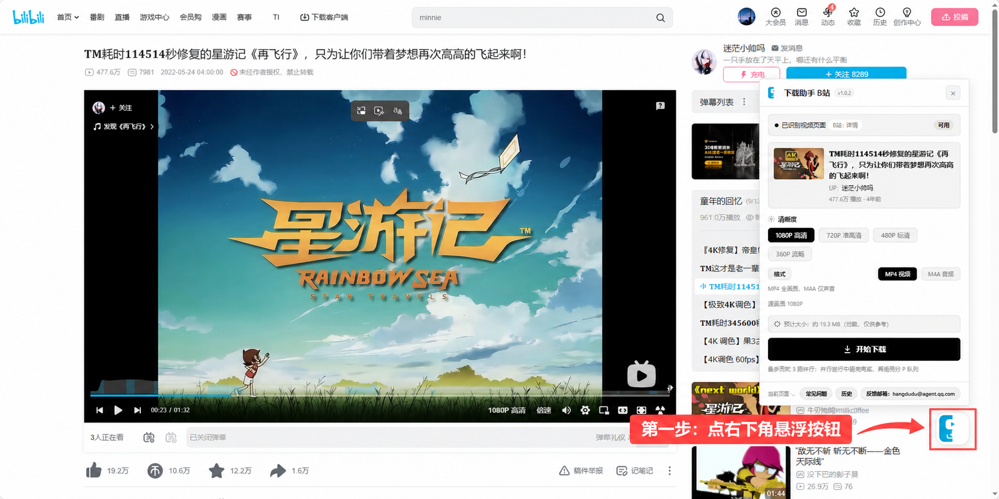
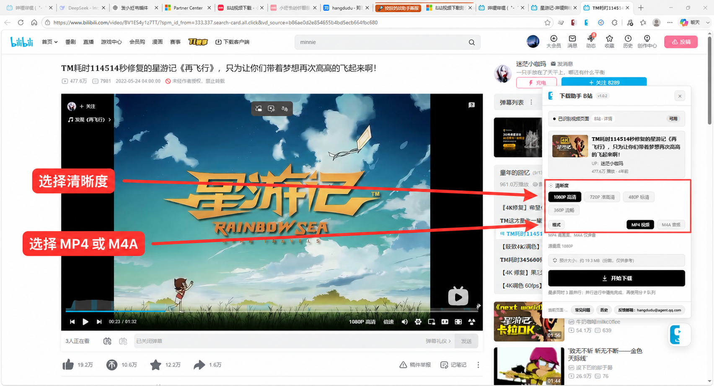
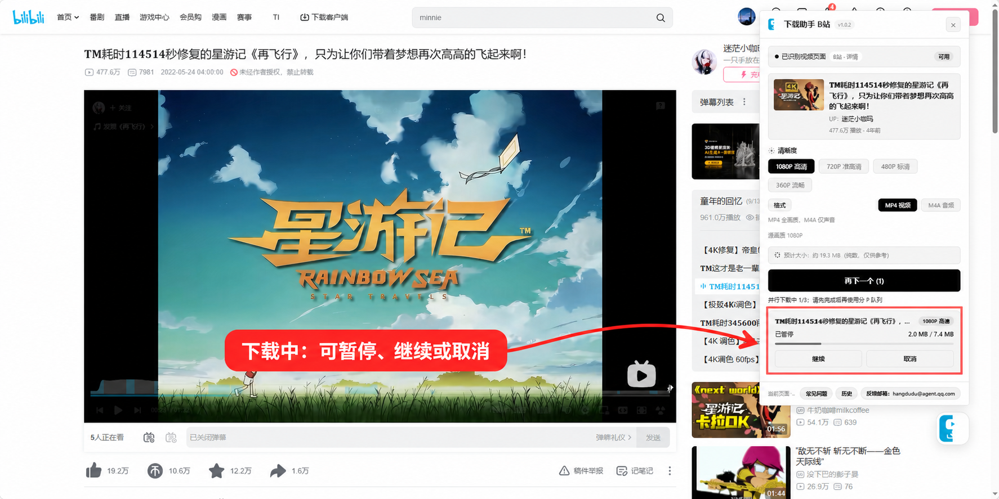

# B站视频怎么下载到电脑？一个不用复制链接的方法

先说结论：如果只是想把**自己有权使用的 B 站普通视频**保存到电脑，比较省事的方式是在浏览器里直接完成，不需要复制 BV 号，也不用把链接粘贴到其他网站。

我自己做了一个浏览器扩展，名字叫「B站视频下载助手」。安装以后打开普通视频页，右下角会出现一个按钮，点开就能选择清晰度和格式。

先说明一下：我是这个扩展的开发者。下面不只介绍怎么安装，也会把使用时最容易疑惑的几个问题讲清楚。

## 为什么 B 站视频不能总是直接“另存为”？

很多人第一次尝试保存 B 站视频时，会发现浏览器里并没有一个完整的 MP4 文件可以直接右键保存。

这是因为不少高清在线视频会把**画面和声音分开传输**。浏览器播放时能正常看到画面、听到声音，但实际拿到的可能是一条视频轨和一条音频轨。所以有些工具下载完成后只有画面没有声音，或者会得到两个分开的文件。

「B站视频下载助手」做的事情并不复杂：读取当前页面实际提供的视频和音频，在电脑本地下载并合并，最后保存成一个可以直接播放的 MP4 文件。

整个过程只在你主动点击下载后开始。

## 具体怎么操作？

### 第一步：安装浏览器扩展

目前可以安装 Edge 版或 Chrome 版，扩展名称都是「B站视频下载助手」。

- Edge 扩展商店：<https://microsoftedge.microsoft.com/addons/detail/b%E7%AB%99%E8%A7%86%E9%A2%91%E4%B8%8B%E8%BD%BD%E5%8A%A9%E6%89%8B/fdcimmiafpnpkehegehnjjkllogfjmem>
- Chrome 扩展商店：<https://chromewebstore.google.com/detail/b%E7%AB%99%E8%A7%86%E9%A2%91%E4%B8%8B%E8%BD%BD%E5%8A%A9%E6%89%8B/dplkepecnmdileeogcflfbjcoonkfaom>

Chrome 商店里同名扩展比较多，建议直接使用上面的链接，并核对名称和版本号。

### 第二步：打开一个普通视频页

扩展支持网址中带有 `/video/BV…` 或普通 av 号的视频页面。

打开页面后，右下角会出现一个悬浮按钮。这个按钮可以拖动，不想挡住页面内容时可以挪到其他位置。

安装后，普通视频页右下角会出现扩展入口。

### 第三步：选择清晰度和格式

点开按钮后，可以看到当前视频的标题、UP 主、分 P 和可用清晰度。

如果想保存完整视频，选择 **MP4**；如果只想听声音，选择 **M4A**。M4A 只有音频，文件通常会小很多，适合演讲、课程或访谈类内容。

面板只显示当前页面实际提供的清晰度；想保存完整视频选 MP4，只听声音选 M4A。

### 第四步：等待保存完成

开始以后，面板会显示下载进度。任务可以暂停、继续或取消；一个视频还没完成时，也可以再开始其他任务，最多同时处理 3 个。

高清内容的画面和声音下载完成后，会直接在浏览器本地合并。合并阶段需要占用一点内存，长视频建议先从 720P 尝试。

任务会显示已下载大小和进度，中途可以暂停、继续或取消。

## 为什么我看不到 1080P？

扩展不会凭空制造清晰度，只会显示 B 站当前页面和账号实际提供的选项。

如果清晰度比较少，可以先检查三件事：

1. 当前是否已经登录 B 站；
2. 登录后有没有刷新视频页面；
3. 这条视频本身是否提供更高清晰度，以及账号是否拥有相应权限。

未登录时通常只能看到较低清晰度。需要会员或其他账号权限的画质，扩展不会绕过限制。

## 分 P 视频能不能一起下载？

可以，但要区分“分 P”和“合集”。

同一个 BV 视频里的 P1、P2、P3 属于传统分 P，扩展可以把它们加入队列，最多同时下载 3 个；单个任务失败后会自动重试一次，也可以随时取消整队。

播放器右侧的合集或系列通常是多个不同的视频地址，这不属于同一个视频的分 P。目前需要打开想保存的那一集，再点击下载。

## 下载记录和隐私怎么办？

扩展会在浏览器本地保留最近 50 条下载历史，方便回到对应视频重新下载。下载历史和悬浮按钮的位置都只保存在自己的浏览器中，不会上传。

扩展不包含统计代码，也不收集或出售用户数据。

## 哪些页面不能用？

目前主要支持 B 站普通视频播放页，不支持番剧页、付费专区，以及任何需要绕过会员、付费或访问限制的内容。

如果页面本身没有向当前账号提供某个视频或清晰度，扩展也不会提供额外的访问能力。

最后还是要提醒一句：工具只解决操作问题，不改变内容本身的版权。请只保存自己创作、获得授权或依法可以使用的内容，并遵守平台规则和著作权规定。

如果安装后没有看到按钮，可以先确认当前网址是不是普通 `/video/` 页面，然后刷新一次。仍然有问题的话，可以把浏览器版本、页面类型和错误现象发给我，我会继续修。

---

扩展名称：B站视频下载助手  
当前版本：1.0.2  
支持浏览器：Microsoft Edge / Google Chrome
